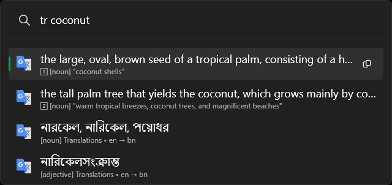

# Google Translate plugin for PowerToys Run

## Build
- git clone https://github.com/nzcodes/GoogleTranslate.git
- Install .NET SDK 10.0.401 from `aka.ms/dotnet/download`
- Run build.bat (gets copied to `%localappdata%\Microsoft\PowerToys\PowerToys Run\Plugins\GoogleTranslate`)
- Restart PowerToys

## Install
- Download .rar from `Releases`
- Extract to `%localappdata%\Microsoft\PowerToys\PowerToys Run\Plugins\`
- Restart PowerToys

## Features
- **Instant Translation**: Type `tr <word>` to translate into your default language (EN).
- **Target Specific Language**: Type `tr hello to spanish`, `tr bonjour en`, or `tr es: good morning`.
- **Phonetics & Pronunciation**: Displays romanization/pronunciation guides for Japanese, Chinese, Arabic, Russian, and more.
- **Zero-Config Web API**: Works out-of-the-box using standard Google Translate endpoints without requiring an expensive billing API key.
- **In-Memory Caching**: Avoids repeated network queries for repeated terms.

## Usage

| Query | What it does |
|---|---|
| `tr apple` | Translates "apple" into target language (en) |
| `tr good morning to es` | Translates "good morning" to Spanish (`es`) |
| `tr bye in fr` | Translates "bye" in French (`fr`) |
| `tr wunderschön en` | Translates German "wunderschön" to English (`en`) |
| `tr ありがとう` | Translates Japanese "arigatou" to English |
| `tr fr: how are you?` | Prefix syntax to translate into French |
